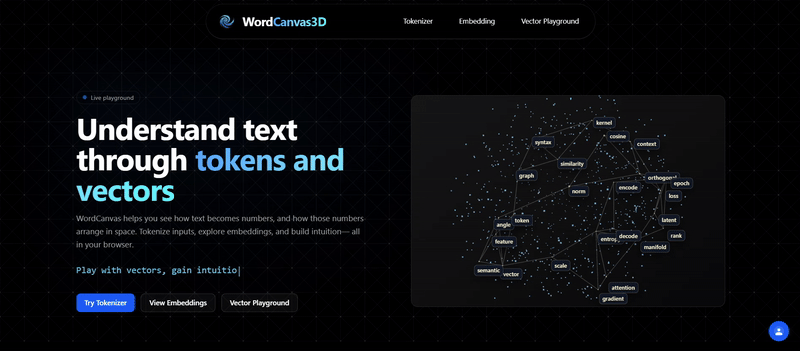
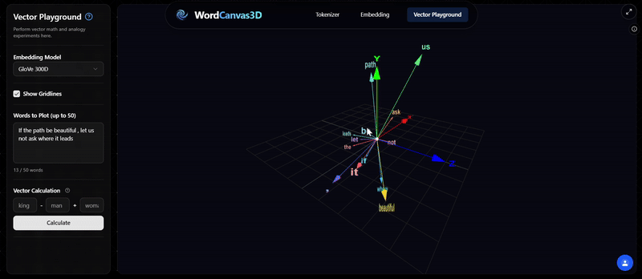
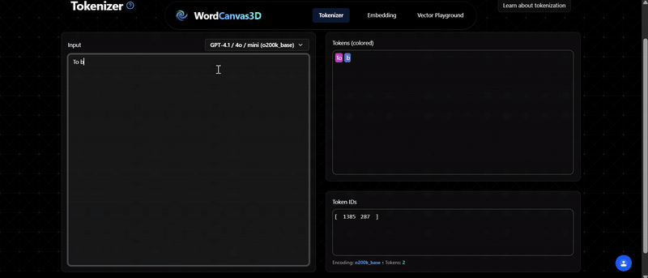

#  WordCanvas3D  

The 3D word playground you didn’t know you needed.

Ever wanted to *walk through* a language model’s brain?  
WordCanvas3D drops you inside the embedding universe — where words float like stars, tokenizers duel for dominance, and `king - man + woman = queen` isn’t a riddle, it’s a vector joyride.

---

<p align="center">
  
  <br/>
  <em>Home page</em>
</p>

---

## 🔍 What is this?

Think of it as **Google Earth for language**.  
Zoom, spin, and tap your way through semantic space. Compare how different models slice up the same sentence. Watch vector math happen in real time. All in a silky-smooth, canvas-first UI that works on your phone and your battlestation.

➡️ **Try it live:** [wordcanvas3d.vercel.app](https://wordcanvas3d.vercel.app)

---

## 📸 Previews

<div align="center" style="width: 100%;">
  
  <em>Embedding space: rotate, search, and tap to inspect words</em>
</div>

<div align="center" style="width: 100%; margin-top: 16px;">
  
  <em>Vector playground: a − b + c → result with nearest neighbors</em>
</div>

<div align="center" style="width: 100%; margin-top: 16px;">
  
  <em>Tokenizer: compare how models split the same text</em>
</div>

<div align="center" style="width: 100%; margin-top: 16px;">
  
  <em>Mobile UI: bottom tray controls and full‑screen canvas</em>
</div>

---

## ✨ Highlights

- Multiple tokenizers – GPT, Llama, and others side-by-side  
- Dimension-reduced 3D view – PCA or UMAP projections of any vocabulary  
- Instant search – fuzzy filter and fly-to-word navigation 🔍  
- Vector math – type three words, get nearest neighbor to the composed vector  
- Touch & desktop – orbit, zoom, tap-to-inspect, no mouse required

---

## 🛠️ Techniques Used

- PCA / UMAP for 3D projection  
- K-Means / DBSCAN for optional clustering overlays  
- Cosine and Euclidean distance for similarity and nearest-neighbor lookup  
- Client-side gzip decompression for faster initial load  
- Incremental data streaming so the first words appear immediately

---

## 📄 Pages

- `/` – landing with live preview canvas  
- `/tokenizer` – pick a tokenizer, type text, see tokens & IDs update live  
- `/embedding` – full 3D view, search, display toggles  
- `/vector-playground` – compose `a - b + c` and inspect results

---

## 🧰 Tech Stack

- Next.js 16 + React 19  
- Tailwind CSS 4 + Shadcn / Radix UI  
- three.js + react-three-fiber  
- Tokenizers: `@dqbd/tiktoken`, `gpt-tokenizer`, `llama-tokenizer-js`  
- Compression: `pako`, `jszip`  
- Python notebooks for preprocessing (PCA, UMAP, clustering, export)

---

## 🏃‍♂️ Run it locally

```bash
git clone https://github.com/Akage1234/WordCanvas3D.git
cd Frontend
npm install
npm run dev
```

---

## 🤝 Contributing

Issues and PRs welcome. Easy starts:

- Add a new embedding set  
- Expose PCA ↔ UMAP toggle in the UI  
- Increase vocabulary size (50 k, 100 k) with lazy loading

---

## 📄 License

MIT
