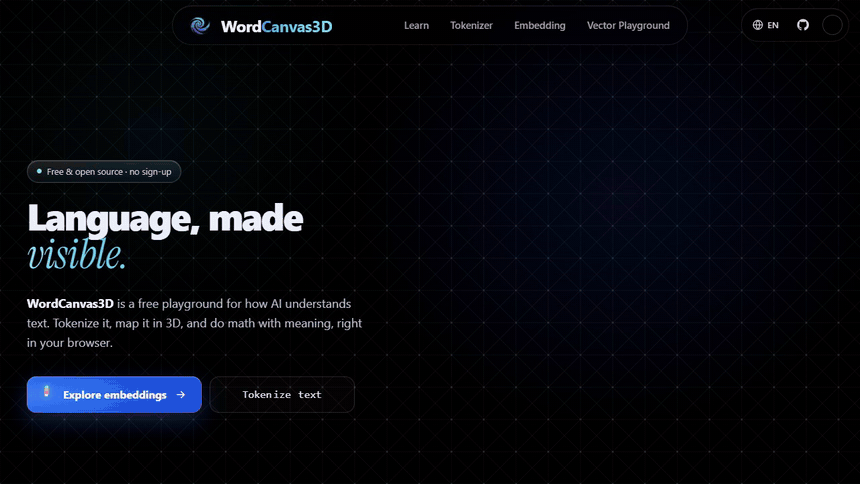
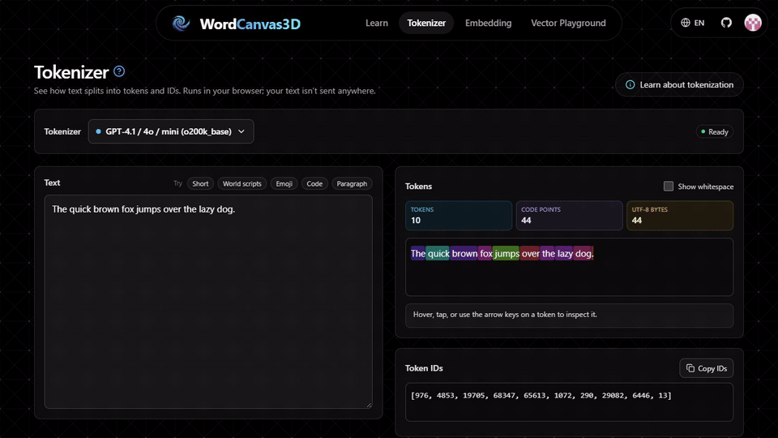
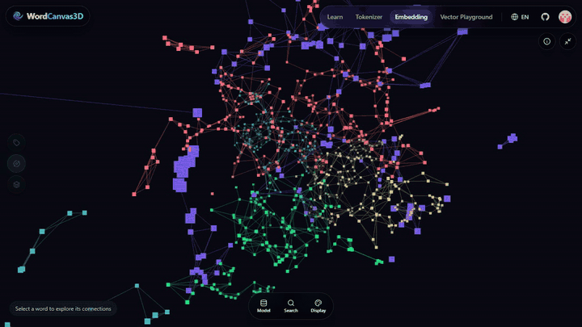
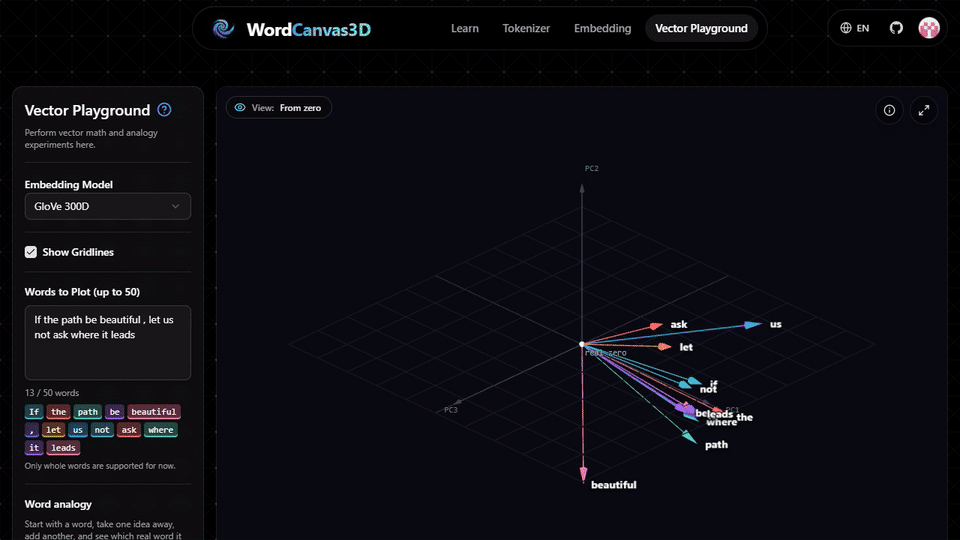
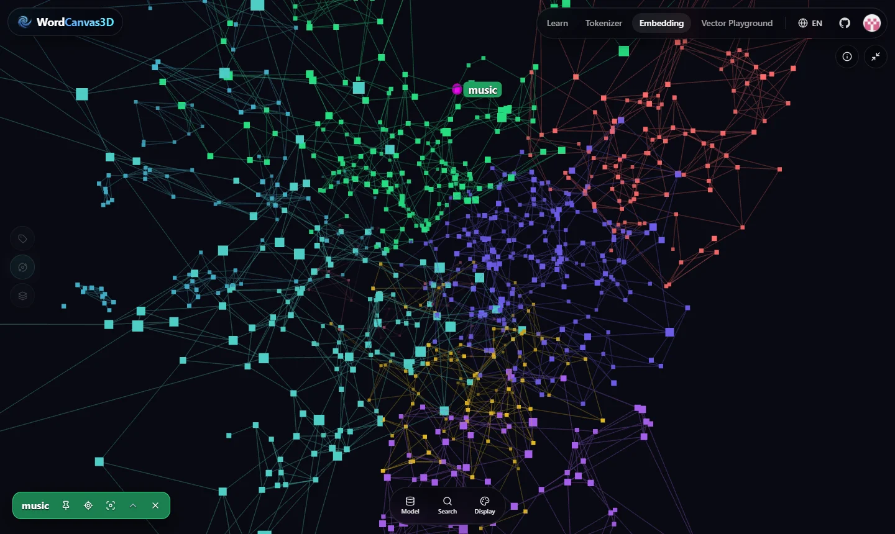
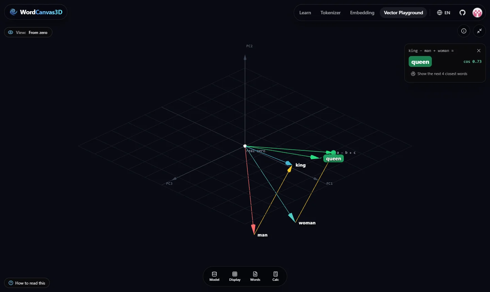
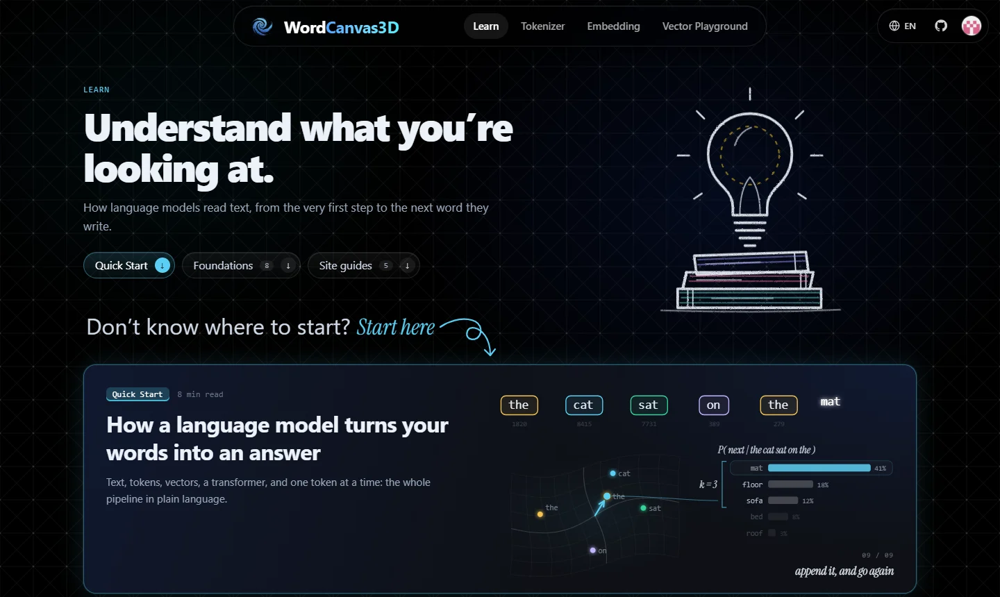
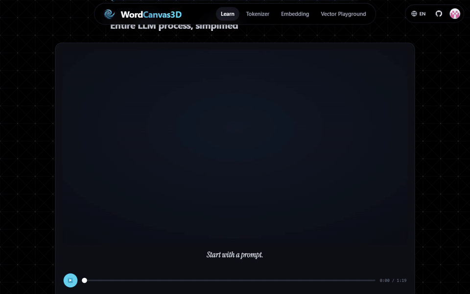
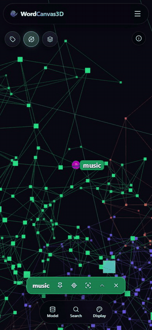
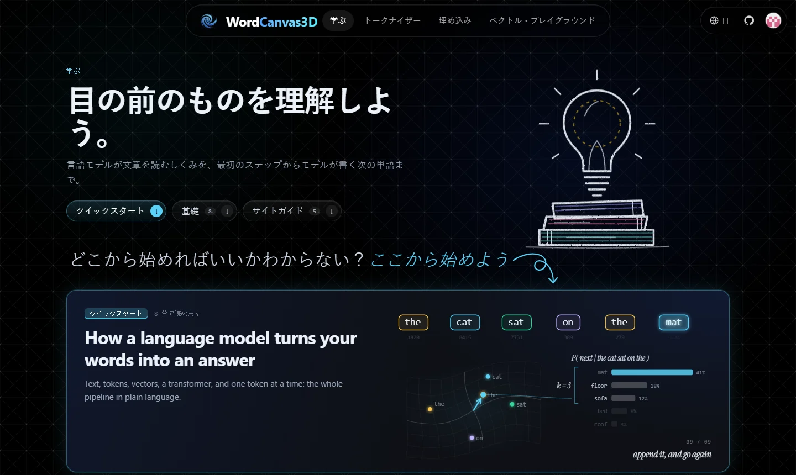

#  WordCanvas3D

**See how AI reads text.**

WordCanvas3D is a free, open-source playground for how language models understand text. Cut a sentence into tokens, fly through thousands of words in 3D, do arithmetic with meaning, and learn how it all fits together, right in your browser. No sign-up, no ads.

➡️ **Try it live:** [wordcanvas3d.vercel.app](https://wordcanvas3d.vercel.app)

<p align="center">
  
</p>

---

## 🧭 What's inside

| | |
|---|---|
| **🔤 Tokenizer** | See exactly how a model splits text into tokens and IDs. Compare GPT (o200k, cl100k, p50k, r50k, GPT-2) and LLaMA tokenizers on the same text. |
| **🌌 Embedding explorer** | Thousands of words from GloVe, Word2Vec and FastText in an interactive 3D map, projected with PCA or UMAP. Search a word, see its neighbours, pin two words to compare. |
| **➕ Vector Playground** | `king − man + woman ≈ queen`. Do arithmetic with word vectors and watch the analogy play out as arrows in 3D. |
| **📚 Learn** | Beginner-friendly articles on tokens, embeddings and transformers, with interactive figures. |

---

## 📸 Tour

### Tokenizer
Switch between presets and tokenizers to see how the same text splits differently, and why emoji and other languages cost more tokens.

<p align="center"></p>

### Embedding explorer
Rotate and zoom the word cloud, switch between UMAP and PCA projections, and search a word to see its nearest neighbours.

<p align="center"></p>

### Vector Playground
Pick an analogy and watch the arrows move: the answer is the word closest to `a − b + c`, computed on all 300 dimensions.

<p align="center"></p>

### Full-screen mode
Go full screen to explore with fewer distractions.

<p align="center"></p>
<p align="center"></p>

### Learn
Beginner-friendly articles on how language models work, covering topics like tokens, embeddings and transformers, with interactive figures along the way.

<p align="center"></p>

<p align="center"></p>

### Made for phones too
Every tool works with touch. On phones the canvas stays full-screen, and controls open in a compact dock that never hides the view.

<p align="center"></p>

### In your language
The interface is available in English, 中文, 日本語 and Español.

<p align="center"></p>

---

## ✨ Highlights

- **Real data:** token IDs come from the real tokenizers; the embeddings are real 300-dimensional GloVe, Word2Vec and FastText vectors.
- **Honest 3D:** PCA or UMAP for the picture, while similarity and analogies always use all 300 dimensions.
- **Runs in your browser:** tokenizers run locally (WebAssembly) and your text is never sent anywhere.
- **Fast to load:** compressed datasets, with the Vector Playground's vectors packed to about 2.5 MB per model.
- **Built for touch:** orbit, pinch, tap to inspect; gestures are never mistaken for taps.
- **Help where you need it:** each tool has a short how-to guide (?) and a concept sheet (ⓘ) that links to the matching Learn articles.

---

## 🧰 Tech stack

- **Framework:** Next.js 16 (App Router) and React 19
- **Styling:** Tailwind CSS 4, shadcn/ui on Radix UI
- **3D:** three.js
- **Tokenizers:** `@dqbd/tiktoken`, `gpt-tokenizer`, `llama-tokenizer-js`
- **Languages:** `next-intl` (English, Chinese, Japanese, Spanish)
- **Data:** `pako` and `jszip` for compressed datasets; Python notebooks for preprocessing (PCA, UMAP, clustering, export)
- **Hosting:** Vercel

---

## 🏃 Run it locally

```bash
git clone https://github.com/Akage1234/WordCanvas3D.git
cd WordCanvas3D/Frontend
npm install
npm run dev
```

Then open [localhost:3000](http://localhost:3000).

| Command | What it does |
|---|---|
| `npm run dev` | Start the development server |
| `npm run build` / `npm start` | Production build and server |
| `npm run lint` | Lint the project |
| `npm run pack:embeddings` | Rebuild the Vector Playground's packed vector files from the full datasets |

For the data pipeline, deployment and more, see [SETUP.md](SETUP.md).

---

## 🤝 Contributing

Issues and pull requests are welcome. Good places to start:

- Add another embedding model
- Translate the Learn articles (the interface is already translated)
- Add another language (see `Frontend/messages/` and `Frontend/messages/GLOSSARY.md`)

---

## 📄 License

MIT. Made with ❤️ by [@Akage](https://github.com/Akage1234).
